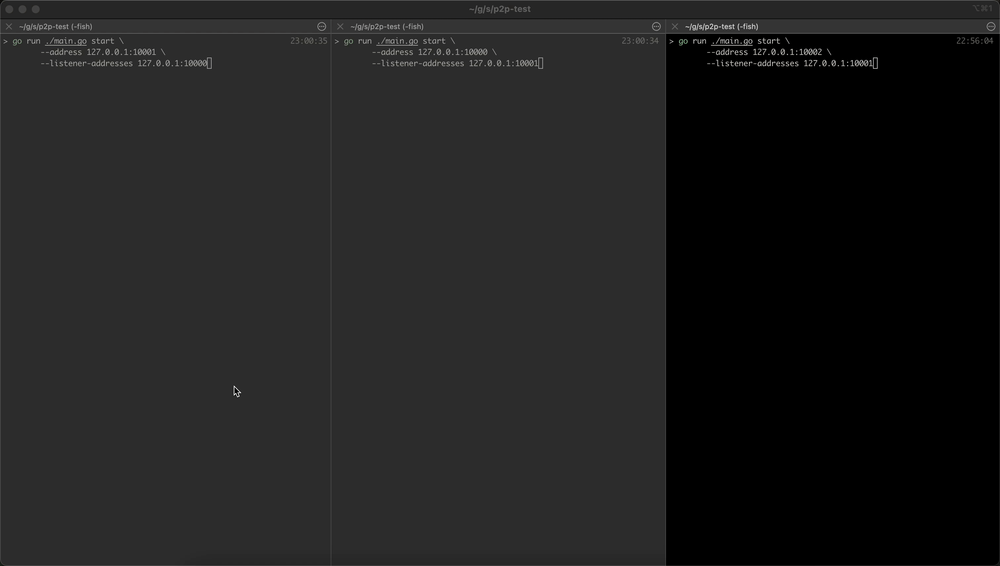

# Test P2P Network

Small playground for experimenting with peer-to-peer style messaging using Go,
gRPC, and a simple CLI.



## Requirements

- Go 1.17+
- `protoc` with the Go gRPC plugin (only needed if you edit `.proto` files)

## Setup

```bash
go get -u
go mod tidy
```

Regenerate protobufs after changing `pkg/ping/ping.proto`:

```bash
protoc --go_out=plugins=grpc:. --go_opt=paths=source_relative pkg/ping/ping.proto
```

## CLI overview

```bash
go run ./main.go --help
```

| Command    | Description                                               |
| ---------- | --------------------------------------------------------- |
| `pingTest` | Spins up two demo nodes, has them ping one another, exits |
| `start`    | Starts a node plus interactive shell (`send`, `exit`)     |

## Quick demo (ping test)

```bash
go run ./main.go pingTest
```

This launches nodes on `127.0.0.1:10000` and `127.0.0.1:10001`, waits briefly,
then has each node ping the other.

## Interactive shell

Start a node with sane defaults:

```bash
go run ./main.go start
```

Useful flags:

- `--address` / `-a` – host:port to bind the local gRPC server (must exist on your box)
- `--listener-addresses` / `-l` – known peers in `host:port` form (repeatable flag)
- `--name` / `-n` – friendly node name (defaults to a UUID)
- `--log-file` – where to write node logs (default `logs/<address>.log`)
- `--verbose` – also stream logs to the interactive console

Every ping reply carries the sender's peer list, so after a node successfully
reaches any peer it will automatically learn about the rest of the network. The
`--listener-addresses` flag is only needed to provide the initial bootstrap(s).

### Two-node local test

Terminal 1:

```bash
go run ./main.go start \
  --address 127.0.0.1:10000 \
  --listener-addresses 127.0.0.1:10001
```

Terminal 2:

```bash
go run ./main.go start \
  --address 127.0.0.1:10001 \
  --listener-addresses 127.0.0.1:10000
```

Now type `send hello` in Terminal 2. Both terminals print live `→` / `←`
notifications showing who sent or received the payload, so you can watch the
message propagate even without verbose logging enabled. Either shell accepts:

- `send <message>` – ping every known peer with the provided payload
- `add-peer <host:port>` – add new peers while the node keeps running
- `peers` – list known peers plus their last-seen timestamp
- `exit` – stop the gRPC server and quit the shell

If you supply an address you do not own (for example `172.0.0.1`), the OS will
return `bind: can't assign requested address`.
